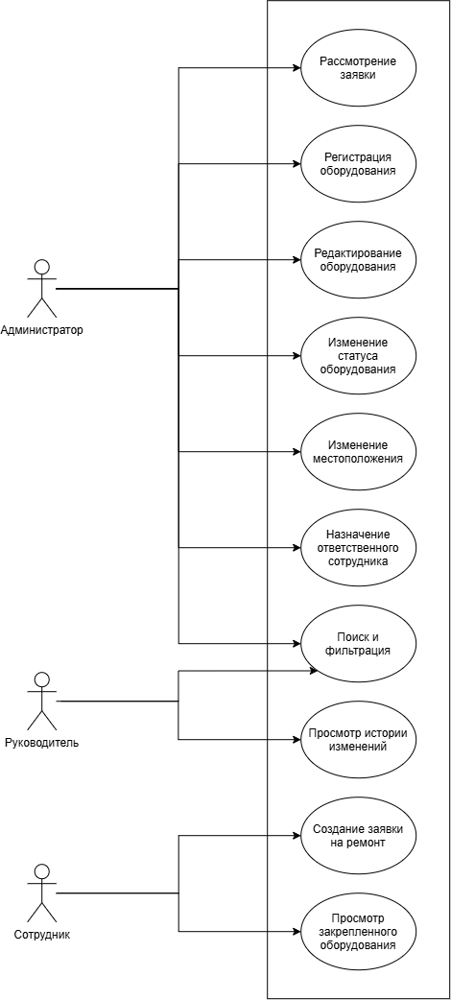
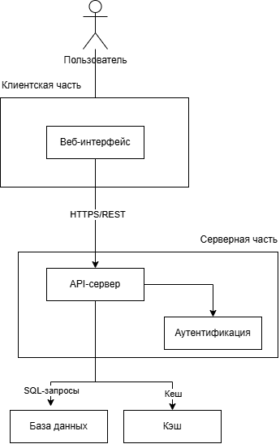

# Лабораторная работа №2
## Проектирование информационной системы

## 1. Описание предметной области

Проблема: учёт офисного оборудования ведётся децентрализованно, что приводит к противоречивости данных и затрудняет оперативный поиск информации о конкретном устройстве.

Цель: разработать информационную систему для централизованного учёта всего перечня оборудования, обеспечивающую достоверность, актуальность и быстрый доступ к данным по каждой единице техники для принятия управленческих решений.

Область применения: система предназначена для использования в службе административно-хозяйственного обеспечения организации для учёта и контроля оборудования.

## 2. Пользователи и роли

Роль | Назначение | Основные задачи | Доступные функции | Уровень доступа
-----|------------|-----------------|-------------------|----------------
Администратор | Полное управление учётом и системой | Ведение реестра, обработка заявок | Регистрация, редактирование, оборудования; смена статуса, местоположения, ответственного; поиск и фильтрация; история изменений; рассмотрение заявок | Полный
Руководитель | Контроль и мониторинг | Просмотр, поиск и фильтрация данных об оборудовании | Просмотр реестра; поиск и фильтрация; просмотр истории изменений | Расширенный (только просмотр)
Сотрудник | Личный учёт и заявки | Просмотр закрепленной за ним техники; создание заявок на ремонт | Просмотр закрепленной за ним техники; создание заявок на ремонт | Ограниченный

## 3. Сценарии использования

- **Рассмотрение заявки** — Администратор открывает список заявок, выбирает новую заявку, принимает решение одобрить или отклонить, при необходимости меняет статус оборудования на «На ремонте».
- **Регистрация оборудования** — Администратор добавляет новую единицу техники в реестр с указанием номера, категории, местоположения, состояния и ответственного сотрудника.
- **Редактирование оборудования** — Администратор изменяет данные карточки оборудования (номер, категория, характеристики).
- **Изменение статуса оборудования** — Администратор переводит оборудование в новое состояние (В работе → На ремонте → Списано → В архиве).
- **Изменение местоположения** — Администратор указывает новое местонахождение оборудования (кабинет, офис, склад).
- **Назначение ответственного сотрудника** — Администратор закрепляет оборудование за конкретным сотрудником.
- **Поиск** — Администратор или Руководитель находит нужную технику по ключевому слову (номер, наименование, сотрудник).
- **Фильтрация** — Администратор или Руководитель формирует перечень оборудования по заданным параметрам (категория, статус, местоположение, ответственный).
- **Просмотр истории изменений** — Администратор или Руководитель видит хронологию всех изменений по конкретной единице оборудования (кто, что, когда изменил).
- **Создание заявки на ремонт** — Сотрудник создаёт заявку на ремонт закреплённого за ним оборудования с описанием неисправности.
- **Просмотр закреплённого оборудования** — Сотрудник видит список техники, закреплённой лично за ним, и её текущее состояние.

## 4. Диаграмма сценариев использования (Use Case)

## 5. Компоненты системы

Компонент | Описание
-----|------------
Веб-интерфейс | Интерфейс для просмотра реестра и создания заявок
API-сервер | Обработка запросов, проверка прав
База данных | Хранение данных оборудования и пользователей, история изменений
Система аутентификации | Проверка пользователя и его роли

## 6. Диаграмма компонентов

## 7. Концепция информационной системы

Система представляет собой веб-приложение, доступное через браузер. Пользователи входят в систему с использованием логина и пароля. После входа администратор может регистрировать новое оборудование, редактировать его данные, изменять статус, местоположение и назначать ответственного сотрудника. Руководитель может просматривать весь реестр оборудования и фильтровать данные по различным критериям. Сотрудник может просматривать оборудование, закрепленное за ним, и создавать заявки на ремонт.

Основные компоненты:
- Веб-интерфейс для взаимодействия с пользователями.
- Серверная часть для обработки запросов и управления данными.
- База данных для хранения информации об оборудовании, пользователях, сотрудниках, местоположениях, заявках и истории изменений.
- API для взаимодействия между веб-интерфейсом и серверной частью.
