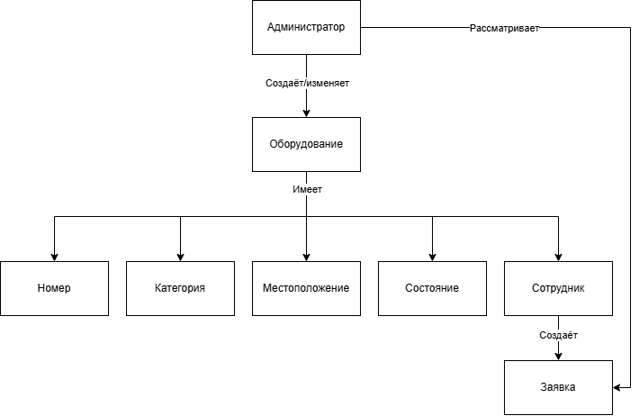

# Отчет по лабораторной №1

## Задание
Вариант 4. Система учета офисного оборудования

Система предназначена для учета компьютеров, мониторов, принтеров и другого оборудования организации. Необходимо хранить информацию об оборудовании, его местоположении, состоянии и ответственном сотруднике. Администратор должен иметь возможность регистрировать оборудование и изменять информацию о нем.

## Проблема и цель
Проблема: учёт офисного оборудования ведётся децентрализованно, что приводит к противоречивости данных и затрудняет оперативный поиск информации о конкретном устройстве.

Цель: разработать информационную систему для централизованного учёта всего перечня оборудования, обеспечивающую достоверность, актуальность и быстрый доступ к данным по каждой единице техники для принятия управленческих решений.

Область применения: система предназначена для использования в службе административно-хозяйственного обеспечения организации для учёта и контроля оборудования.

## Объекты предметной области
- Администратор
- Оборудование
  - Номер
  - Категория
  - Местоположение
  - Состояние
  - Сотрудник
- Заявка

## Роли и пользователи

Роль | Назначение | Основные действия
-----|------------|------------------
Администратор | Полное управление учётом и системой | Создание и редактирование оборудования; управление пользователями; рассмотрение заявок
Руководитель | Контроль и мониторинг | Просмотр, поиск и фильтрация данных об оборудовании
Сотрудник | Личный учёт и заявки | Просмотр закрепленной за ним техники; создание заявок на ремонт

## Функциональные требования

Система должна позволять:
- Регистрировать оборудование
- Редактировать оборудование
- Изменять статус оборудования
- Изменять местоположение оборудования
- Назначать ответственного сотрудника
- Поиск и фильтрацию
- Аутентификацию и авторизацию
- Просматривать историю изменений
- Создание заявок на ремонт оборудования

## Концепция ИС

Система представляет собой веб-приложение, доступное через браузер. Пользователи входят в систему с использованием логина и пароля. После входа администратор может регистрировать новое оборудование, редактировать его данные, изменять статус, местоположение и назначать ответственного сотрудника. Руководитель может просматривать весь реестр оборудования и фильтровать данные по различным критериям. Сотрудник может просматривать оборудование, закрепленное за ним, и создавать заявки на ремонт.

Основные компоненты:

- Веб-интерфейс для взаимодействия с пользователями.
- Серверная часть для обработки запросов и управления данными.
- База данных для хранения информации об оборудовании, пользователях, сотрудниках, местоположениях, заявках и истории изменений.
- API для взаимодействия между веб-интерфейсом и серверной частью.
