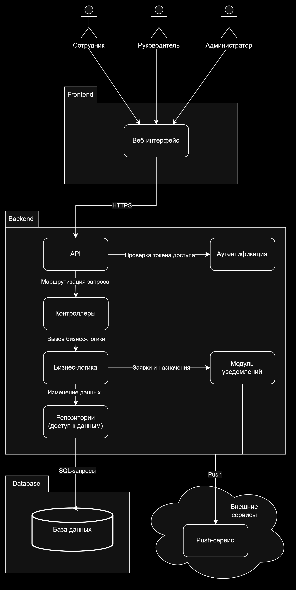
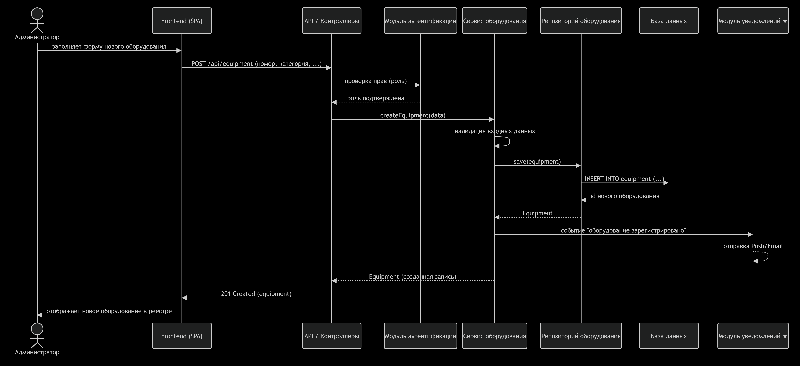

# Лабораторная работа №3
## Проектирование архитектуры информационной системы

### Цель работы

Изучить принципы проектирования архитектуры информационных систем, определить структуру приложения, спроектировать взаимодействие между основными компонентами и подготовить структуру программного проекта для дальнейшей разработки.

---

## Краткое описание выполненного задания

На основе предметной области «Система учёта офисного оборудования» (лабораторные работы №1–2) спроектирована архитектура информационной системы: выбран архитектурный стиль, определены компоненты и их ответственность, описано взаимодействие компонентов на примере одного сценария, разработана структура каталогов проекта, а также выделена и отражена в архитектуре индивидуальная нетиповая особенность предметной области — уведомление пользователей о событиях (новая заявка на ремонт, назначение ответственного сотрудника).

---

## Основные результаты работы

### 1. Архитектурный стиль

Трехуровненвая архитектура веб-приложения (3-tier).

Frontend (клиентская часть) - интерфейс
Backend (серверная часть) - обработка запросов
Database (база данных) - хранение данных

### 2. Компоненты системы

Компонент | Назначение и ответственность
----------|-----------------------------
Веб-интерфейс (Frontend) | Отображение реестра оборудования, поиск, фильтрация, создание заявок
API | Прием HTTP запросов от веб-интерфейса
Контроллеры | Разбор запросов и вызов нужных сервисов, формирование ответов
Бизнес-логика (сервисы) | Валидация данных, бизнес правила
Репозитории | Доступ к данным, чтение и запись в базу данных
Модуль аутентификации | Проверка личности пользователя и его роли
Модуль уведомлений | Отправка уведомлений
База данных | Хранение реестра оборудования, истории измененеий, спико сотрудников, заявки


### 3. Взаимодействие компонентов

Общая последовательность обработки запроса пользователя:

1. Пользователь выполняет действие в веб-интерфейсе
2. Frontend отправляет HTTP запрос на backend к API
3. API проверяет права доступа
4. Контроллер вызывает сервис бизнес-логики
5. Сервис валидирует данные и обращается к репозиторию для сохранения или чтения данных
6. Репозиторий выполняет SQL запрос к БД
7. При необходимости сервис отправляет уведомление
8. Результат действия возвращается через API обратно на frontend и отображается пользователю

### 4. Структура проекта

```
project/
├── frontend/               # клиентская часть
├── backend/                # серверная часть
│   ├── controllers/        # обработка HTTP запросов
│   ├── services/           # бизнес логика
│   ├── repositories/       # доступ к данным
│   ├── models/             # модели данных
│   └── routes/             # API маршруты
├── database/               # схема БД
└── README.md               # результат работы по лабораторной
```

### 5. Индивидуальная особенность предметной области

В системе была выделена нетиповая особенность - уведломление администратора о создании ответсвтенным сотрудником заявки на ремонт оборудования, а также уведомление сотруднику о прикреплении к нему нового оборудования. Одного запроса к БД недостаточно — нужен механизм push-уведомлений, который отслеживает события в системе и мгновенно рассылает их адресатам.

---

## Диаграммы и схемы

### Диаграмма архитектуры системы



**Исходник:** [`diagrams/src/architecture.drawio`](./diagrams/src/architecture.drawio)

### Диаграмма вазимодействия компонентов



**Исходник:** [`diagrams/src/interaction.drawio`](./diagrams/src/interaction.drawio)

## Вывод

В результате работы спроектирована архитектура информационной системы «Система учёта офисного оборудования» на основе трёхуровневого подхода (Frontend / Backend / Database). Определены зоны ответственности каждого компонента, описано взаимодействие между ними на конкретном сценарии, выделена индивидуальная особенность предметной области (уведомления о событиях в реальном времени) и отвечающий за неё компонент — модуль уведомлений. Подготовлена структура каталогов будущего проекта. Полученные результаты формируют основу для реализации системы в последующих лабораторных работах.