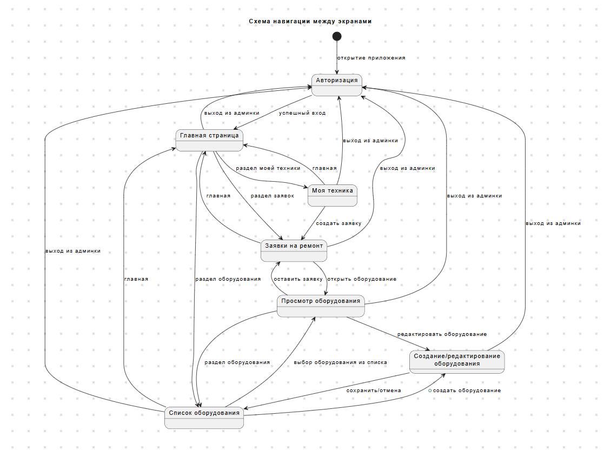
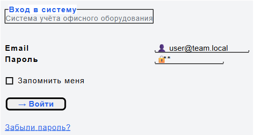
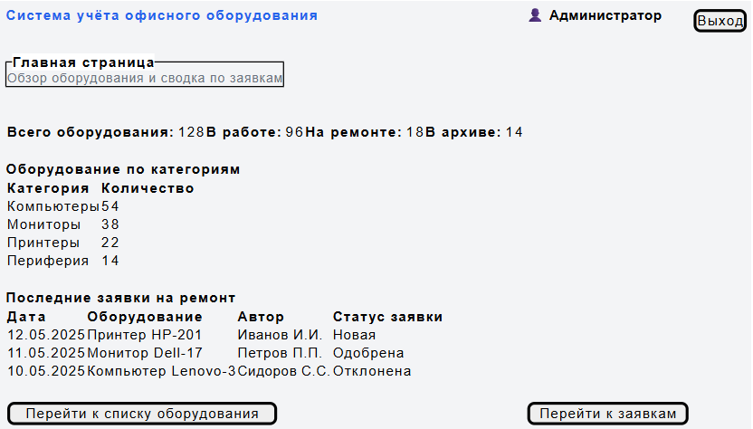
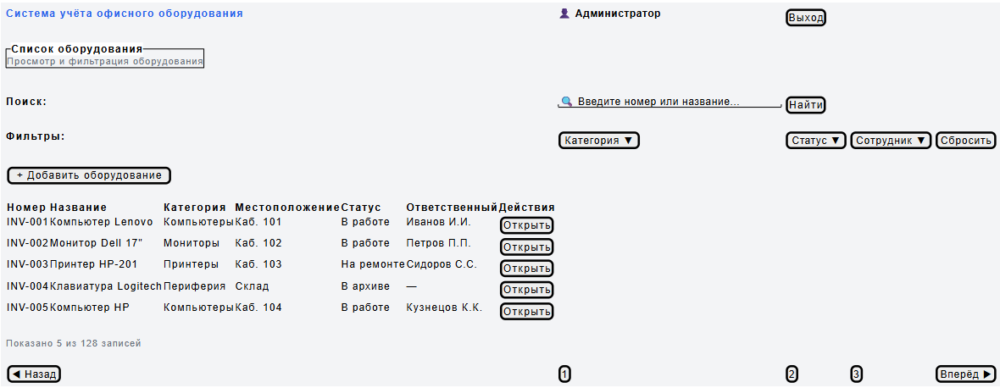
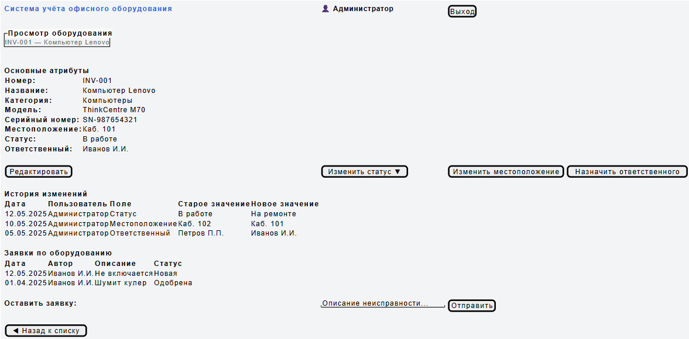
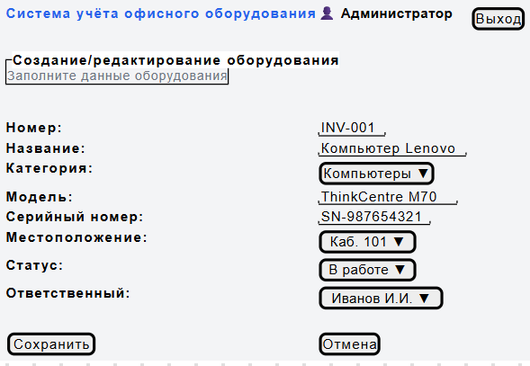
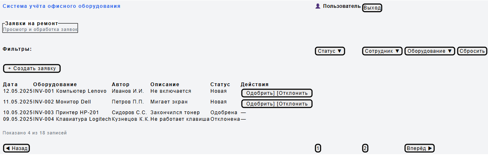
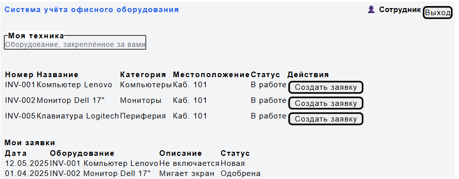

# Лабораторная работа №4
## Проектирование пользовательского интерфейса

### Цель работы

Изучить основные принципы проектирования пользовательских интерфейсов, разработать структуру экранов информационной системы, спроектировать навигацию и подготовить интерактивные или статические макеты страниц.

---

## Краткое описание выполненного задания

На основе архитектуры информационной системы «Система учёта офисного оборудования» (лабораторные работы №1–3) спроектирован пользовательский интерфейс приложения: определён перечень экранов и их назначение, разработана схема навигации между экранами, подготовлены wireframe-прототипы основных страниц, а также описаны принятые решения по организации интерфейса с учётом ролей пользователей.

---

## Основные результаты работы

### 1. Структура экранов

| № | Экран | Назначение | Основные элементы | Действия пользователя |
|---|---|---|---|---|
| 1 | Авторизация | Вход в систему | Поля email/пароль, чекбокс «запомнить меня» | Войти, восстановить пароль |
| 2 | Главная страница | Обзор оборудования и сводка по заявкам | Список категорий оборудования с количеством, сводка по статусам оборудования | Перейти к категории, к списку оборудования |
| 3 | Список оборудования | Просмотр и фильтрация оборудования | Таблица оборудования, фильтры по оборудованию (категория/статус/сотрудник) | Найти, открыть, создать оборудование |
| 4 | Просмотр оборудования | Детальная информация об оборудовании | Атрибуты оборудования, история изменений, список заявок по оборудованию, форма заявки | Изменить статус, редактировать, оставить заявку |
| 5 | Создание/редактирование оборудования | Ввод данных нового оборудования, редактирование существующего | Форма для редактирования оборудования (категория, название, сотрудник, статус, местоположение) | Создать, сохранить, отменить |
| 6 | Заявки на ремонт | Просмотр и обработка заявок | Таблица заявок, фильтры по заявкам (статус/сотрудник/оборудование) | Создать, одобрить, отклонить заявку |
| 7 | Моя техника | Просмотр закреплённого оборудования | Список закреплённого оборудования с состоянием, кнопка «Создать заявку» | Просмотреть, создать заявку |

### 2. Навигация между экранами

Навигация построена вокруг главной страницы как центральной точки, пользователь может попасть на неё из любого раздела через верхнее меню, а также перемещается между списком оборудования, карточкой оборудования и формой создания/редактирования оборудования. Интерфейс сотрудника ограничен правами доступа и включает только разделы «Моя техника» и «Заявки на ремонт».

***Исходник: *** [./diagrams/src/navigation.puml](./diagrams/src/navigation.puml)

### 3. Прототипы страниц

Прототипы выполнены в формате Wireframe с помощью PlantUML Salt - позволяет хранить в текстовом виде и легко вносить изменения

#### Экран 1. Авторизация

#### Экран 2. Главная страница

#### Экран 3. Список оборудования

#### Экран 4. Просмотр оборудования

#### Экран 5. Создание/редактирование оборудования

#### Экран 6. Заявки на ремонт

#### Экран 7. Моя техника

## Вывод

В результате работы спроектирован пользовательский интерфейс информационной системы «Система учёта офисного оборудования»: определены 7 экранов, разработана схема навигации, подготовлены wireframe-прототипы основных страниц. Интерфейс учитывает роли пользователей, обеспечивает единообразие оформления и минимальное количество действий для выполнения основных операций. Полученные результаты формируют основу для реализации клиентской части системы в последующих лабораторных работах.

**Структура репозитория:**

lab4/
├── README.md
├── diagrams/
│   ├── images/
│   │   └── navigation.png
│   └── src/
│       └── navigation.puml
└── design/
    ├── images/
    │   ├── 01-login.png
    │   ├── 02-main.png
    │   ├── 03-list.png
    │   ├── 04-equipment.png
    │   ├── 05-edit_create.png
    │   ├── 06-application.png
    │   └── 07-my_equipment.png
    └── src/
        ├── 01-login.puml
        ├── 02-main.puml
        ├── 03-list.puml
        ├── 04-equipment.puml
        ├── 05-edit_create.puml
        ├── 06-application.puml
        └── 07-my_equipment.puml